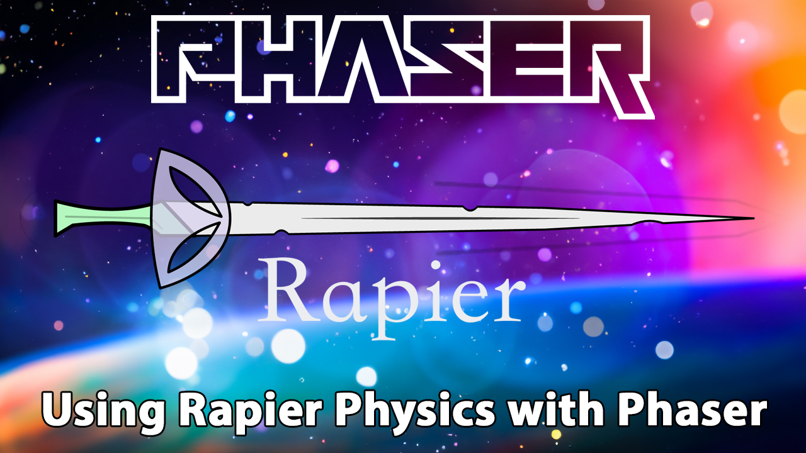

# Phaser Rapier Template

This is a Phaser 3 project template that uses Vite for bundling and Rapier physics. It supports hot-reloading for quick development workflow and includes scripts to generate production-ready builds.

### Versions

This template has been updated for:

- [Phaser 3.80.1](https://github.com/phaserjs/phaser)
- [Vite 5.2.11](https://github.com/vitejs/vite)
- [Rapier 0.14.0](https://github.com/dimforge/rapier)



## Requirements

[Node.js](https://nodejs.org) is required to install dependencies and run scripts via `npm`.

## Available Commands

| Command | Description |
|---------|-------------|
| `npm install` | Install project dependencies |
| `npm run dev` | Launch a development web server |
| `npm run build` | Create a production build in the `dist` folder |

## Writing Code

After cloning the repo, run `npm install` from your project directory. Then, you can start the local development server by running `npm run dev`.

The local development server runs on `http://localhost:8080` by default. Please see the Vite documentation if you wish to change this, or add SSL support.

Once the server is running you can edit any of the files in the `src` folder. Vite will automatically recompile your code and then reload the browser.

## Template Project Structure

We have provided a default project structure to get you started. This is as follows:

- `index.html` - A basic HTML page to contain the game.
- `src` - Contains the game source code.
- `src/main.js` - The main entry point. This contains the game configuration and starts the game.
- `src/scenes/` - The Phaser Scenes are in this folder.
- `public/style.css` - Some simple CSS rules to help with page layout.
- `public/assets` - Contains the static assets used by the game.

## Handling Assets

Vite supports loading assets via JavaScript module `import` statements.

This template provides support for both embedding assets and also loading them from a static folder. To embed an asset, you can import it at the top of the JavaScript file you are using it in:

```js
import logoImg from './assets/logo.png'
```

To load static files such as audio files, videos, etc place them into the `public/assets` folder. Then you can use this path in the Loader calls within Phaser:

```js
preload ()
{
    //  This is an example of an imported bundled image.
    //  Remember to import it at the top of this file
    this.load.image('logo', logoImg);

    //  This is an example of loading a static image
    //  from the public/assets folder:
    this.load.image('background', 'assets/bg.png');
}
```

When you issue the `npm run build` command, all static assets are automatically copied to the `dist/assets` folder.

## Using Rapier Physics in PhaserJS

This template includes the integration of the Rapier physics system in PhaserJS. Below are the steps necessary to initialize Rapier and get the physics system working in your project.

### Configuring Rapier in the Scene
In your main scene file, import Rapier. Then, initialize Rapier and set up the physics world in the create method.

### Overview

We begin by importing the `@dimforge/rapier2d-compat` package, which provides compatibility with Rapier's 2D physics system. After initializing the Rapier physics engine, a physics world is created with gravity, and game objects are linked to rigid bodies and colliders to enable realistic physical interactions.

In the `create` method, a game object (an image) is added to the scene, and a corresponding dynamic rigid body and cuboid collider are created for it. User data is used to associate the game object with the rigid body, allowing synchronization of its position and rotation based on physics calculations.

The `update` method steps the physics simulation on each frame, updating the game objects' positions and rotations to reflect the physics world's current state. This setup ensures that game objects behave according to the laws of physics, such as gravity and collision response, providing a more immersive and interactive gameplay experience.

Below is the complete code to set up and use Rapier physics in your PhaserJS project:

```js
import RAPIER from '@dimforge/rapier2d-compat';

export class Game extends Scene
{
    ...

    async create ()
    {
        // Initialization: Initialize Rapier with await RAPIER.init(). Then, create a new Rapier world with gravity set to 9.81.
        await RAPIER.init();
        this.rapierWorld = new RAPIER.World(new RAPIER.Vector2(0.0, 9.81));

        // Create a Phaser game object (an image) and set its position.
        const logo = this.add.image(512, 100, 'logo');

        // Create a Rapier dynamic rigid body and set its initial position.
        const rigidBodyDesc = RAPIER.RigidBodyDesc.dynamic()
            .setTranslation(logo.x, logo.y);

        // Store the Phaser game object in the rigid body's user data to sync its position and rotation.
        rigidBodyDesc.setUserData(logo);

        // Create the rigid body in the Rapier world.
        const rigidBody = this.rapierWorld.createRigidBody(rigidBodyDesc);

        // Create a collider descriptor with a cuboid shape and set its restitution to 0.7.
        const colliderDesc = RAPIER.ColliderDesc.cuboid(logo.displayWidth / 2, logo.displayHeight / 2);
        colliderDesc.setRestitution(0.7);

        // Create the collider in the Rapier world, attaching it to the rigid body.
        this.rapierWorld.createCollider(colliderDesc, rigidBody);   
    }

    update ()
    {
        // Check if the Rapier world is initialized.
        if (this.rapierWorld !== undefined)
        {
            // Step the physics simulation.
            this.rapierWorld.step();

            // Update the Phaser game objects based on the physics simulation.
            this.rapierWorld.bodies.forEach((rigidBody) => {
                const gameObject = rigidBody.userData;
                if (gameObject !== undefined)
                {
                    const position = rigidBody.translation();
                    const angle = rigidBody.rotation();
                    gameObject.x = position.x;
                    gameObject.y = position.y;
                    gameObject.setRotation(angle);
                }
            });
        }
    }
}
```

If you follow these steps, you should be able to integrate Rapier physics into your PhaserJS project successfully. By setting up the physics world, creating rigid bodies and colliders, and updating game objects based on physics calculations, you can create interactive games with realistic physical interactions. More information on Rapier can be found in the [Rapier documentation](https://rapier.rs/docs/).

## Deploying to Production

After you run the `npm run build` command, your code will be built into a single bundle and saved to the `dist` folder, along with any other assets your project imported, or stored in the public assets folder.

In order to deploy your game, you will need to upload *all* of the contents of the `dist` folder to a public facing web server.

## Customizing the Template

### Vite

If you want to customize your build, such as adding plugin (i.e. for loading CSS or fonts), you can modify the `vite/config.*.mjs` file for cross-project changes, or you can modify and/or create new configuration files and target them in specific npm tasks inside of `package.json`. Please see the [Vite documentation](https://vitejs.dev/) for more information.

## Join the Phaser Community!

We love to see what developers like you create with Phaser! It really motivates us to keep improving. So please join our community and show-off your work 😄

**Visit:** The [Phaser website](https://phaser.io) and follow on [Phaser Twitter](https://twitter.com/phaser_)<br />
**Play:** Some of the amazing games [#madewithphaser](https://twitter.com/search?q=%23madewithphaser&src=typed_query&f=live)<br />
**Learn:** [API Docs](https://newdocs.phaser.io), [Support Forum](https://phaser.discourse.group/) and [StackOverflow](https://stackoverflow.com/questions/tagged/phaser-framework)<br />
**Discord:** Join us on [Discord](https://discord.gg/phaser)<br />
**Code:** 2000+ [Examples](https://labs.phaser.io)<br />
**Read:** The [Phaser World](https://phaser.io/community/newsletter) Newsletter<br />

Created by [Phaser Studio](mailto:support@phaser.io). Powered by coffee, anime, pixels and love.

The Phaser logo and characters are &copy; 2011 - 2024 Phaser Studio Inc.

All rights reserved.
