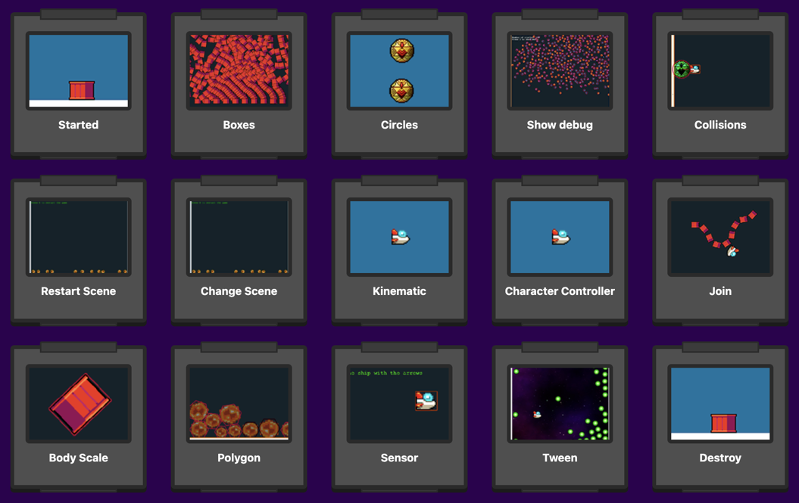

# Phaser Rapier Template

This is a Phaser 3 project template that shows how to use Rapier physics for managing a full-body physics world. It also uses Vite for bundling and supports hot-reloading for quick development workflow and includes scripts to generate production-ready builds.

Please also see the Rapier Connector Template. This offers a Phaser plugin that handles the most common Rapier functions for you: [Rapier Connector repository](https://github.com/phaserjs/rapier-connector).

### Versions

This template has been updated for:

- [Phaser 3.88.0](https://github.com/phaserjs/phaser)
- [Rapier 0.14.0](https://github.com/dimforge/rapier)
- [Vite 5.2.11](https://github.com/vitejs/vite)


## Requirements

[Node.js](https://nodejs.org) is required to install dependencies and run scripts via `npm`.

## Available Commands

| Command | Description |
|---------|-------------|
| `npm install` | Install project dependencies |
| `npm run dev` | Launch a development web server |
| `npm run build` | Create a production build in the `dist` folder |
| `npm run dev-nolog` | Launch a development web server without sending anonymous data (see "About log.js" below) |
| `npm run build-nolog` | Create a production build in the `dist` folder without sending anonymous data (see "About log.js" below) |

## Writing Code

After cloning the repo, run `npm install` from your project directory. Then, you can start the local development server by running `npm run dev`.

The local development server runs on `http://localhost:8080` by default. Please see the Vite documentation if you wish to change this, or add SSL support.

Once the server is running you can edit any of the files in the `src` folder. Vite will automatically recompile your code and then reload the browser.

## Template Project Structure

We have provided a default project structure to get you started. This is as follows:

- `index.html` - A basic HTML page to contain the game.
- `src` - Contains the game source code.
- `src/main.js` - The main entry point. This contains the game configuration and starts the game.
- `src/scenes/` - The Phaser Scenes are in this folder.
- `public/style.css` - Some simple CSS rules to help with page layout.
- `public/assets` - Contains the static assets used by the game.

## Source Code Examples

You can find 15 different code examples of how to use Rapier with Phaser in this [Rapier Phaser Sandbox](https://phaser.io/sandbox/full/ZhbGYVBa)

[](https://phaser.io/sandbox/full/ZhbGYVBa)

## Using Rapier Physics in Phaser

This template includes the integration of the Rapier physics system in Phaser. Below are the steps necessary to initialize Rapier and get the physics system working in your project.

### Configuring Rapier in the Phaser Scene

In your main Phaser Scene file you need to import the Rapier library.

```js
import RAPIER from '@dimforge/rapier2d-compat';

class Game extends Phaser.Scene {}
```

Then initialize Rapier and configure the physics world in the `create` method:

```js
import RAPIER from '@dimforge/rapier2d-compat';

export class Game extends Phaser.Scene
{
    async create ()
    {
        // Initialization: Initialize Rapier with await RAPIER.init().
        // Then, create a new Rapier world with gravity set to 9.81:
        await RAPIER.init();

        this.rapierWorld = new RAPIER.World(new RAPIER.Vector2(0.0, 9.81));
    }
}
```

It's import to mark this method as `async` because the `RAPIER.init()` call returns a Promise and runs in async. It doesn't return immediately. For this reason, we `await` it in our code above, but you can handle the promise however you like. See the Rapier documentation for further details.

### Overview

Once the Rapier World has been created we can make bodies and colliders, and assign these to Phaser Game Objects to enable realistic physical interactions.

In the following `create` method, a Phaser Image Game Object is added to the Scene, and a corresponding dynamic rigid body and cuboid collider are created for it:

```js
// Create a Phaser game object (an image) and set its position.
const player = this.add.image(400, 300, 'player');

// Create a Rapier dynamic rigid body
const bodyDesc = RAPIER.RigidBodyDesc.dynamic();

// Set its initial position to match our Phaser Game Object
bodyDesc.setTranslation(player.x, player.y);

// Store the Phaser Game Object in the rigid body's user data so we can sync its position and rotation
bodyDesc.setUserData(player);

// Finally, create the rigid body in the Rapier world from the body description
const rigidBody = this.rapierWorld.createRigidBody(bodyDesc);
```

We store a reference to the Phaser Game Object in the Body Description User data. This allows us to easily get back to the Game Object later on, such as during update, or collisions, to sync the two objects together. You can of course come up with your own way of linking the Game Object and body but this is the one we use in this template due to its simplicity.

We'll now update the two objects during the update loop.

`update` is a special Phaser Scene method that is called automatically every frame by Phaser. During it, we will step the physics simulation:

```js
    update ()
    {
        // Check if the Rapier world is initialized or not
        if (!this.rapierWorld)
        {
            return;
        }

        // Step the physics simulation.
        this.rapierWorld.step();
    }
```

After the World step, we can integrate the body position back to the Phaser Game Object. If you have a reference to the Rigid Body and Game Object, it can be done like this:

```js
    update ()
    {
        // Check if the Rapier world is initialized or not
        if (!this.rapierWorld)
        {
            return;
        }

        // Step the physics simulation.
        this.rapierWorld.step();

        //  Assuming 'rigidBody' is a Rapier Rigid Body:

        const position = this.rigidBody.translation();
        const rotation = this.rigidBody.rotation();

        //  Assuming 'player' is a Phaser Sprite, Image, or similar Game Object:

        this.player.setPosition(position.x, position.y);
        this.player.setRotation(rotation);
    }
```

Alternatively, you can use the Rigid Body User Data and sync all of the bodies with Game Objects in a single loop:

```js
    update ()
    {
        // Check if the Rapier world is initialized or not
        if (!this.rapierWorld)
        {
            return;
        }

        // Step the physics simulation.
        this.rapierWorld.step();

        this.rapierWorld.bodies.forEach((rigidBody) => {
   
            const gameObject = rigidBody.userData;

            if (gameObject)
            {
                const position = rigidBody.translation();
                const rotation = rigidBody.rotation();
                gameObject.setPosition(position.x, position.y);
                gameObject.setRotation(angle);
            }
        });
    }
```

This works by extracting the Game Object from the User Data and, if it exists, setting the translations upon it.

Both methods will allow Game Objects to reflect the physic worlds current state, ensuring that the Game Objects behave according to the laws of physics, such as gravity and collision responses.

Below is a complete code example showing all of these steps:

```js
import RAPIER from '@dimforge/rapier2d-compat';

export class Game extends Phaser.Scene
{
    async create ()
    {
        // Initialization: Initialize Rapier with await RAPIER.init(). Then, create a new Rapier world with gravity set to 9.81.
        await RAPIER.init();

        this.rapierWorld = new RAPIER.World(new RAPIER.Vector2(0.0, 9.81));

        // Create a Phaser game object (an image) and set its position.
        const logo = this.add.image(512, 100, 'logo');

        // Create a Rapier dynamic rigid body and set its initial position.
        const rigidBodyDesc = RAPIER.RigidBodyDesc.dynamic();
            
        rigidBodyDesc.setTranslation(logo.x, logo.y);

        // Store the Phaser game object in the rigid body's user data to sync its position and rotation.
        rigidBodyDesc.setUserData(logo);

        // Create the rigid body in the Rapier world.
        const rigidBody = this.rapierWorld.createRigidBody(rigidBodyDesc);

        // Create a collider descriptor with a cuboid shape and set its restitution to 0.7.
        const colliderDesc = RAPIER.ColliderDesc.cuboid(logo.displayWidth / 2, logo.displayHeight / 2);
        colliderDesc.setRestitution(0.7);

        // Create the collider in the Rapier world, attaching it to the rigid body.
        this.rapierWorld.createCollider(colliderDesc, rigidBody);   
    }

    update ()
    {
        // Check if the Rapier world is initialized.
        if (this.rapierWorld !== undefined)
        {
            // Step the physics simulation.
            this.rapierWorld.step();

            // Update the Phaser game objects based on the physics simulation.
            this.rapierWorld.bodies.forEach((rigidBody) => {
                const gameObject = rigidBody.userData;
                if (gameObject !== undefined)
                {
                    const position = rigidBody.translation();
                    const angle = rigidBody.rotation();
                    gameObject.x = position.x;
                    gameObject.y = position.y;
                    gameObject.setRotation(angle);
                }
            });
        }
    }
}
```

If you follow these steps, you should be able to integrate Rapier physics into your Phaser project successfully. By setting up the physics world, creating rigid bodies and colliders, and updating game objects based on physics calculations, you can create interactive games with realistic physical interactions.

More information on Rapier and the functions it has available can be found in the [Rapier documentation](https://rapier.rs/docs/).

## Handling Assets

Vite, used for bundling in this template, supports loading assets via JavaScript module `import` statements.

This template provides support for both embedding assets and also loading them from a static folder. To embed an asset, you can import it at the top of the JavaScript file you are using it in:

```js
import logoImg from './assets/logo.png'
```

To load static files such as audio files, videos, etc place them into the `public/assets` folder. Then you can use this path in the Loader calls within Phaser:

```js
preload ()
{
    //  This is an example of an imported bundled image.
    //  Remember to import it at the top of this file
    this.load.image('logo', logoImg);

    //  This is an example of loading a static image
    //  from the public/assets folder:
    this.load.image('background', 'assets/bg.png');
}
```

When you issue the `npm run build` command, all static assets are automatically copied to the `dist/assets` folder.

## Deploying to Production

After you run the `npm run build` command, your code will be built into a single bundle and saved to the `dist` folder, along with any other assets your project imported, or stored in the public assets folder.

In order to deploy your game, you will need to upload *all* of the contents of the `dist` folder to a public facing web server.

## Customizing the Template

### Vite

If you want to customize your build, such as adding plugin (i.e. for loading CSS or fonts), you can modify the `vite/config.*.mjs` file for cross-project changes, or you can modify and/or create new configuration files and target them in specific npm tasks inside of `package.json`. Please see the [Vite documentation](https://vitejs.dev/) for more information.

## About log.js

If you inspect our node scripts you will see there is a file called `log.js`. This file makes a single silent API call to a domain called `gryzor.co`. This domain is owned by Phaser Studio Inc. The domain name is a homage to one of our favorite retro games.

We send the following 3 pieces of data to this API: The name of the template being used (vue, react, etc). If the build was 'dev' or 'prod' and finally the version of Phaser being used.

At no point is any personal data collected or sent. We don't know about your project files, device, browser or anything else. Feel free to inspect the `log.js` file to confirm this.

Why do we do this? Because being open source means we have no visible metrics about which of our templates are being used. We work hard to maintain a large and diverse set of templates for Phaser developers and this is our small anonymous way to determine if that work is actually paying off, or not. In short, it helps us ensure we're building the tools for you.

However, if you don't want to send any data, you can use these commands instead:

Dev:

```bash
npm run dev-nolog
```

Build:

```bash
npm run build-nolog
```

Or, to disable the log entirely, simply delete the file `log.js` and remove the call to it in the `scripts` section of `package.json`:

Before:

```json
"scripts": {
    "dev": "node log.js dev & dev-template-script",
    "build": "node log.js build & build-template-script"
},
```

After:

```json
"scripts": {
    "dev": "dev-template-script",
    "build": "build-template-script"
},
```

Either of these will stop `log.js` from running. If you do decide to do this, please could you at least join our Discord and tell us which template you're using! Or send us a quick email. Either will be super-helpful, thank you.

## Join the Phaser Community!

We love to see what developers like you create with Phaser! It really motivates us to keep improving. So please join our community and show-off your work 😄

**Visit:** The [Phaser website](https://phaser.io) and follow on [Phaser Twitter](https://twitter.com/phaser_)<br />
**Play:** Some of the amazing games [#madewithphaser](https://twitter.com/search?q=%23madewithphaser&src=typed_query&f=live)<br />
**Learn:** [API Docs](https://newdocs.phaser.io), [Support Forum](https://phaser.discourse.group/) and [StackOverflow](https://stackoverflow.com/questions/tagged/phaser-framework)<br />
**Discord:** Join us on [Discord](https://discord.gg/phaser)<br />
**Code:** 2000+ [Examples](https://labs.phaser.io)<br />
**Read:** The [Phaser World](https://phaser.io/community/newsletter) Newsletter<br />

Created by [Phaser Studio](mailto:support@phaser.io). Powered by coffee, anime, pixels and love.

The Phaser logo and characters are &copy; 2011 - 2024 Phaser Studio Inc.

All rights reserved.
